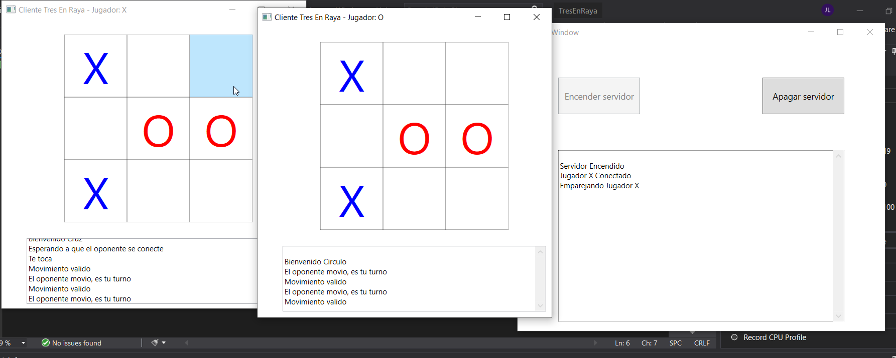

# TresEnRaya-.NET

The solution file is located in "TresEnRaya" folder.

To run the solution you need to have the two folders "ClienteTresEnRaya" and "TresEnRaya" in the same directory.

---

This project is a Tic Tac Toe Game using .NET Framework 4.7.2

Libraries:

WPF for the User Interface

Sockets to do the communication

